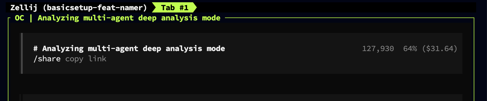

# opencode-zellij-namer

AI-powered dynamic Zellij session naming for [OpenCode](https://opencode.ai).

Automatically renames your Zellij terminal sessions based on what you're working on — project name, task type (feat, fix, debug, etc.), and contextual tags derived from your activity.



*The plugin automatically renamed this session to `basicsetup-feat-namer` — project directory (basicsetup), intent (feat), and contextual tag (namer).*

## Features

- **Automatic naming**: Sessions named like `myproject-feat-auth` or `api-debug-cache`
- **AI-powered**: Uses Gemini 3 Flash to generate contextual, meaningful names
- **AGENTS.md aware**: Reads project-specific naming conventions from your repo's `AGENTS.md`
- **Custom instructions**: Personal naming preferences via env var (override AGENTS.md)
- **Non-blocking**: Fire-and-forget design never slows down your workflow
- **Stability-first**: Debouncing and cooldowns prevent name thrashing
- **Privacy-conscious**: Only sends minimal context to AI (see [Privacy](#privacy))
- **Fallback heuristics**: Works without AI using pattern matching

## Installation

```bash
# Install globally
npm install -g opencode-zellij-namer

# Or add to your OpenCode config
```

Add to your `~/.config/opencode/opencode.json`:

```json
{
  "plugin": ["opencode-zellij-namer"]
}
```

## Configuration

All configuration is via environment variables:

| Variable | Default | Description |
|----------|---------|-------------|
| `GEMINI_API_KEY` | - | Google AI API key for smart naming |
| `OPENCODE_ZELLIJ_DEBUG` | `0` | Set to `1` for debug logging |
| `OPENCODE_ZELLIJ_COOLDOWN_MS` | `300000` | Minimum ms between renames (5 min) |
| `OPENCODE_ZELLIJ_DEBOUNCE_MS` | `5000` | Debounce interval for checks (5 sec) |
| `OPENCODE_ZELLIJ_MODEL` | `gemini-3-flash-preview` | Gemini model to use |
| `OPENCODE_ZELLIJ_MAX_SIGNALS` | `25` | Max activity signals to retain |
| `OPENCODE_ZELLIJ_TIMEOUT_MS` | `3000` | AI request timeout |
| `OPENCODE_ZN_INSTRUCTIONS` | - | Custom naming instructions for AI |
| `OPENCODE_ZN_USE_AGENTS_MD` | `1` | Set to `0` to disable AGENTS.md reading |

### AGENTS.md Integration

The plugin automatically reads naming guidance from your project's `AGENTS.md` file. This allows you to define project-specific naming conventions that all contributors will follow.

**Supported locations** (checked in order):
- `./AGENTS.md`
- `./.github/AGENTS.md`
- `./docs/AGENTS.md`

**Extracted sections** (by priority):
1. `## Naming` or `## Session Naming` — entire section content
2. `## Guidelines` — lines containing "naming", "session", "tag", or "intent"

**Example AGENTS.md:**

```markdown
# My Project

## Session Naming

- Use team prefix "acme-" for all sessions
- Prefer ticket numbers as tags (e.g., acme-feat-jira123)
- Use "api" instead of "backend" for backend work
```

The plugin extracts this guidance and includes it in the AI prompt.

**To disable:** Set `OPENCODE_ZN_USE_AGENTS_MD=0`

### Custom Instructions

You can provide custom instructions to guide the AI naming:

```bash
export OPENCODE_ZN_INSTRUCTIONS="Use short codenames. Prefer 'api' over 'backend'. Always include ticket numbers from todos."
```

This is useful for:
- Enforcing team naming conventions
- Using project codenames instead of directory names
- Prioritizing certain context (e.g., ticket numbers)
- Adjusting tag preferences

### Precedence

When both AGENTS.md and custom instructions are present:

1. **AGENTS.md** — Project-level guidance (shared with team)
2. **Custom Instructions** — User-level overrides (personal preference)

Custom instructions **take precedence** over AGENTS.md when they conflict. This allows teams to define baseline conventions in AGENTS.md while individual developers can customize for their workflow.

### Example

```bash
export GEMINI_API_KEY="your-api-key"
export OPENCODE_ZELLIJ_DEBUG=1
export OPENCODE_ZELLIJ_COOLDOWN_MS=600000  # 10 minutes
```

## How It Works

### Naming Format

```
project-intent[-tag]
```

- **project**: From package.json name, git repo, or directory (max 20 chars)
- **intent**: One of `feat`, `fix`, `debug`, `refactor`, `test`, `doc`, `ops`, `review`, `spike`
- **tag**: Optional context like `auth`, `api`, `cache` (max 15 chars)

### Examples

| Activity | Generated Name |
|----------|---------------|
| Working on new feature | `myapp-feat` |
| Debugging auth issues | `myapp-debug-auth` |
| Writing tests | `api-test` |
| Refactoring database code | `backend-refactor-db` |
| Reviewing PR | `frontend-review` |

### Trigger Events

The plugin listens to these OpenCode events:
- `session.idle` — After each AI turn completes
- `file.edited` — When you edit files
- `command.executed` — When you run commands
- `todo.updated` — When todos change

### Stability Mechanisms

- **Debounce**: 5-second minimum between checks
- **Cooldown**: 5-minute minimum between actual renames
- **Signal accumulation**: Builds context over time for better naming

### Uniqueness

While Zellij allows duplicate session names, this plugin attempts to generate unique names to help you distinguish between multiple sessions working on the same project.

**Disambiguation strategy:**

1. **Branch name**: If on `feat/user-auth`, adds `-auth` tag
2. **Directory context**: Working in `src/payments/` adds `-payments` tag  
3. **Task keywords**: Todo mentioning "caching" adds `-cache` tag
4. **Time-based**: Falls back to `-am`/`-pm`/`-eve` based on time of day
5. **Numeric suffix**: Last resort adds `-2`, `-3`, etc.

**Example scenario:**

| Session | Context | Generated Name |
|---------|---------|----------------|
| Terminal 1 | Working on auth | `myapp-feat-auth` |
| Terminal 2 | Same project, payments | `myapp-feat-payments` |
| Terminal 3 | Same project, morning | `myapp-feat-am` |

This ensures you can identify which terminal is which at a glance, even with multiple sessions on the same project.

## Privacy

When AI naming is enabled, the following data is sent to Google's Gemini API:

| Data | Example | Purpose |
|------|---------|---------|
| Project name | `myapp` | Anchor for session name |
| Recent file paths | `src/auth/login.ts` | Infer working area |
| Command names | `npm test` | Infer task type |
| Todo summaries | `fix login bug` | Infer intent |
| Conversation snippets | `debug the auth flow` | Contextual naming |

**What is NOT sent:**
- File contents
- Command output
- Full conversation history
- Environment variables
- System information

**To disable AI**: Simply don't set `GEMINI_API_KEY`. The plugin falls back to heuristic naming.

## Requirements

- [OpenCode](https://opencode.ai) v0.1.0+
- [Zellij](https://zellij.dev) terminal multiplexer
- Node.js 18+
- (Optional) Google AI API key for smart naming

## Troubleshooting

### Plugin not loading

Check OpenCode logs for errors. Enable debug mode:
```bash
export OPENCODE_ZELLIJ_DEBUG=1
```

### Session not renaming

1. Verify you're inside a Zellij session: `echo $ZELLIJ_SESSION_NAME`
2. Check Zellij is in PATH: `which zellij`
3. Wait for cooldown period (default 5 min)

### AI naming not working

1. Verify API key: `echo $GEMINI_API_KEY`
2. Check network connectivity
3. Enable debug logging to see AI responses

## Development

### Fork & Clone

1. Fork this repo on GitHub
2. Clone your fork:

```bash
git clone https://github.com/YOUR_USERNAME/opencode-zellij-namer
cd opencode-zellij-namer
```

3. Update `package.json` with your fork's URL:

```bash
# Replace YOUR_USERNAME with your GitHub username
sed -i 's/24601/YOUR_USERNAME/g' package.json
```

### Build & Test

```bash
npm install
npm run build
npm test
```

### Local Development

To test your changes with OpenCode, update your config to point to your local build:

```json
{
  "plugin": ["/path/to/your/opencode-zellij-namer"]
}
```

## License

MIT — see [LICENSE](LICENSE)

## Contributing

See [CONTRIBUTING.md](CONTRIBUTING.md)
